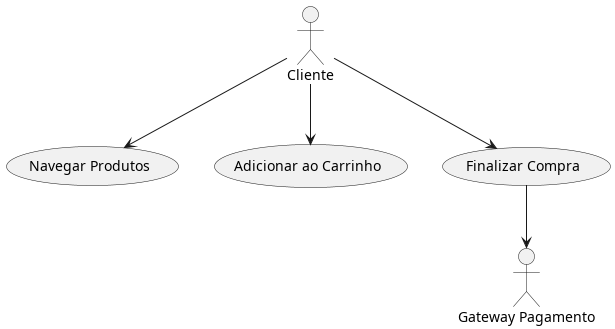
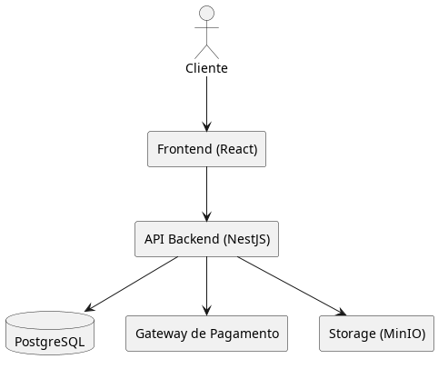

# **Documentação do Projeto – E-commerce Fictício**

## **1. Visão Geral do Projeto**

**Objetivo:**  
Desenvolver uma plataforma de e-commerce B2C para venda de produtos eletrônicos, com carrinho de compras, gateway de pagamento, área do cliente e painel administrativo.

**Stakeholders:**

-   **Cliente Final:** Usuários que compram produtos.
    
-   **Administrador:** Responsável por gerenciar produtos, pedidos e usuários.
    
-   **Equipe Técnica:** Desenvolvedores, QA, UX/UI.
    
-   **Fornecedor de Pagamentos:** Integração com gateway (ex.: PagSeguro).
    

----------

## **2. Escopo do Projeto**

### **Funcionalidades (Requisitos Funcionais – RF)**

1.  Cadastro e login de usuários.
    
2.  Listagem e busca de produtos.
    
3.  Carrinho de compras.
    
4.  Checkout com cálculo de frete.
    
5.  Pagamento online (Cartão e Pix).
    
6.  Acompanhamento de pedidos.
    
7.  Painel administrativo (CRUD de produtos, categorias e relatórios).
    

### **Requisitos Não Funcionais (RNF)**

-   **Performance:** Resposta do servidor em < 2s para 95% das requisições.
    
-   **Disponibilidade:** Uptime mínimo de 99,9%.
    
-   **Segurança:** Criptografia de dados sensíveis (AES-256) e autenticação JWT.
    
-   **Escalabilidade:** Suporte a 1.000 usuários simultâneos.
    
-   **SEO:** URLs amigáveis e suporte a Open Graph.
    

### **Regras de Negócio (RFC)**

-   Pedidos acima de R$ 300 possuem frete grátis.
    
-   O carrinho expira em 24h caso o pagamento não seja concluído.
    
-   Produtos com estoque zerado não podem ser adicionados ao carrinho.
    

----------

## **3. Estudo de Caso de Uso**

### **Caso: Realizar Compra**

**Ator Principal:** Cliente.  
**Fluxo Principal:**

1.  Cliente adiciona produtos ao carrinho.
    
2.  Confirma endereço e frete.
    
3.  Escolhe forma de pagamento (Cartão/Pix).
    
4.  Gateway de pagamento retorna status de aprovação.
    
5.  Sistema gera pedido e envia confirmação por e-mail.
    

**Fluxos Alternativos:**

-   Pagamento recusado → sistema informa erro e mantém carrinho.
    
-   Produto sem estoque → exibe alerta ao cliente.
    

**Diagrama UML (Caso de Uso):**

----------

## **4. Modelagem de Dados (Banco de Dados)**

### **Entidades Principais:**

-   **Usuário (id, nome, email, senha_hash)**
    
-   **Produto (id, nome, preço, estoque, categoria_id)**
    
-   **Pedido (id, usuario_id, valor_total, status)**
    
-   **ItensPedido (pedido_id, produto_id, quantidade)**
    

### **Normalização:**

-   1FN: Separação de produtos e itens de pedido.
    
-   2FN: Atributos dependem da chave primária.
    
-   3FN: Remoção de dependências transitivas (ex.: CEP → cidade em tabela separada).
    

**Problema comum:** Consultas lentas com tabelas grandes.  
**Solução:**

-   Indexação em colunas de busca.
    
-   Cache com Redis para consultas frequentes (como listagem de produtos).
    

----------

## **5. Arquitetura do Sistema**

-   **Frontend:** React + Next.js.
    
-   **Backend:** NestJS (Node.js) com arquitetura modular.
    
-   **Banco de Dados:** PostgreSQL.
    
-   **Mensageria:** RabbitMQ para fila de e-mails.
    
-   **Armazenamento de Imagens:** MinIO/S3.
    

**Diagrama de Arquitetura:**

----------

## **6. Plano de Testes**

-   **Testes Unitários:** Cobrir funções críticas (checkout, login).
    
-   **Testes de Integração:** Validação entre backend e gateway de pagamento.
    
-   **Testes de Carga:** Simular 1.000 usuários simultâneos.
    
-   **Testes de Segurança:** Testar SQL Injection e XSS.
    

----------

## **7. Problemas Identificados e Soluções**

**Problema**

**Impacto**

**Solução Proposta**

Consultas lentas em listagem de produtos

Degradação de performance

Cache Redis + indexação de colunas.

Checkout falhando em horários de pico

Perda de vendas

Fila assíncrona com RabbitMQ para processar pedidos.

Carrinhos abandonados

Redução da taxa de conversão

Notificações automáticas por e-mail (job agendado).

Falhas de pagamento

Reclamações de clientes

Log detalhado de transações + fallback de pagamento.

----------

## **8. Cronograma (Exemplo)**

1.  **Discovery de requisitos** – 2 semanas.
    
2.  **Prototipação (wireframes)** – 1 semana.
    
3.  **Backend + BD (MVP)** – 4 semanas.
    
4.  **Frontend (MVP)** – 4 semanas.
    
5.  **Testes e ajustes** – 2 semanas.
    
6.  **Implantação inicial** – 1 semana.
    

----------

## **9. Monitoramento e Observabilidade**

-   **Logs:** Usar ELK Stack (Elasticsearch + Logstash + Kibana).
    
-   **Métricas:** Prometheus + Grafana para monitoramento de performance.
    
-   **Alertas:** Configurar alertas para quedas de serviço.
    

----------

## **10. Próximos Passos e Melhorias Futuras**

-   Criar app mobile (React Native).
    
-   Sistema de recomendações com IA (baseado no histórico de compras).
    
-   Implementar testes E2E com Cypress.
    

----------

### **Quer que eu gere agora um documento pronto em formato Markdown (com seções já estruturadas), que você poderia usar como modelo base para um projeto real de e-commerce?**